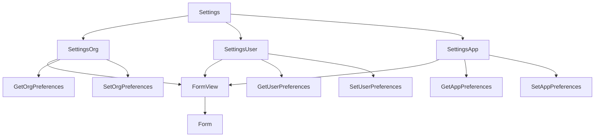
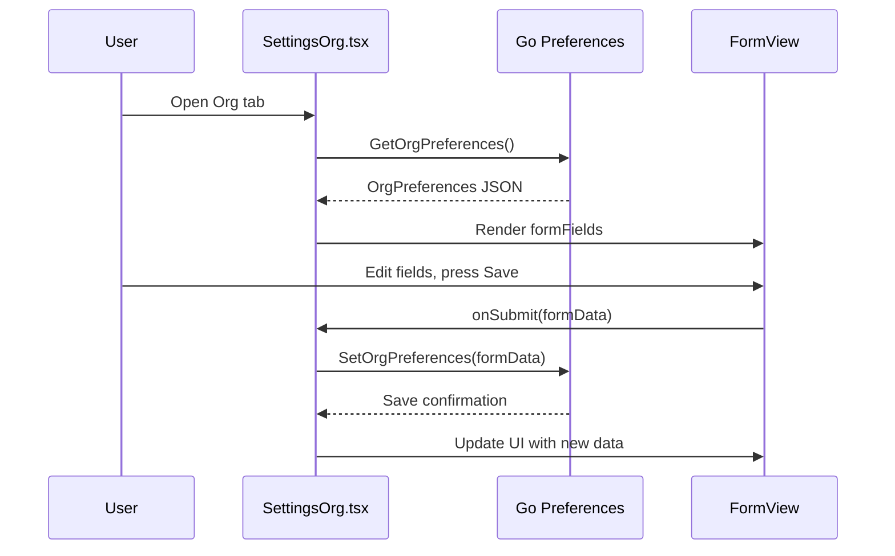
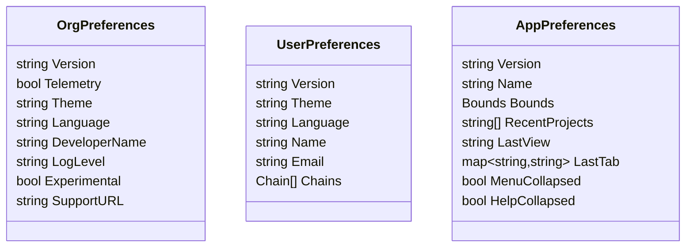
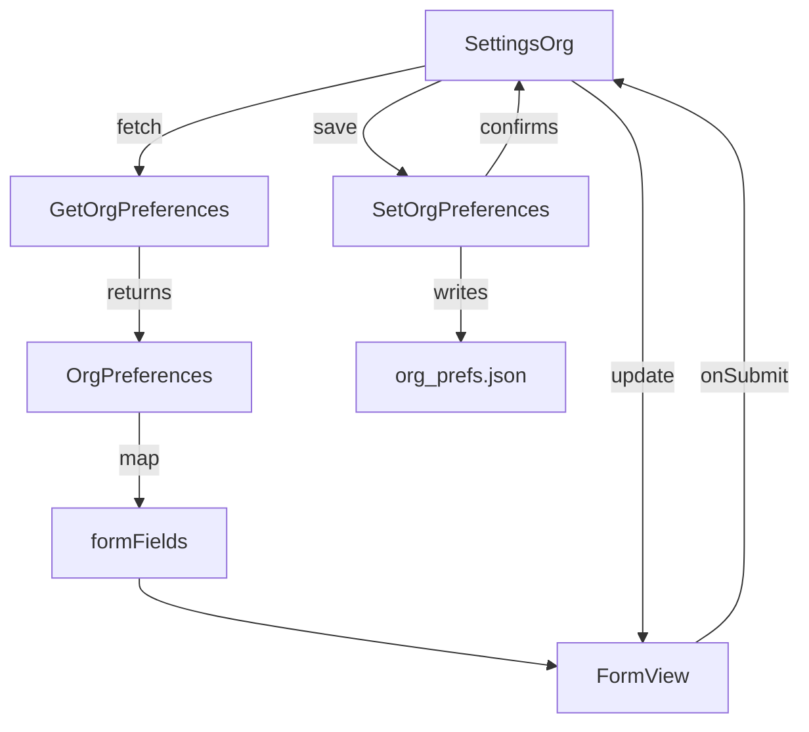

# Settings Views Design (Frontend & Backend Integration)

This document explains the structure, data flow, and backend integration of the settings views. These components use the `FormView` abstraction and are fully wired to persist changes to the backend and update the UI in real time.

---

## 1. File/Component Relationship

---

## 2. Data & Event Lifecycle: How Settings Work

**Narrative:**

- When a user opens a settings tab, the component fetches the relevant preferences from the backend (Go).
- The data is mapped to form fields and rendered using `FormView`.
- When the user edits and saves, the new data is sent to the backend, persisted, and the UI is updated.

---

## 3. Preferences Structure (Backend)

---

## 4. Rendering & Update Logic

---

## 5. Backend Persistence

- Preferences are stored as JSON files on disk (e.g., `org_prefs.json`, `user_prefs.json`, `app_prefs.json`).
- Each `Get*Preferences` function loads and parses the file, returning a struct.
- Each `Set*Preferences` function serializes the struct and writes it to disk.
- The backend ensures directories exist and handles errors gracefully.

---

## 6. Real-Time UI Update

- After saving, the frontend updates its state with the new preferences.
- If the user cancels, the form resets to the last saved state.
- Status messages are emitted for user feedback.

---

## Summary

- **SettingsOrg**, **SettingsUser**, and **SettingsApp** are entry points for editing organization, user, and app preferences.
- Each uses `FormView` and is fully integrated with backend Go code for persistence.
- The system ensures that changes are immediately reflected in both the backend and the UI.
- No files in `./frontend/wails` are documented here, as they are auto-generated.
